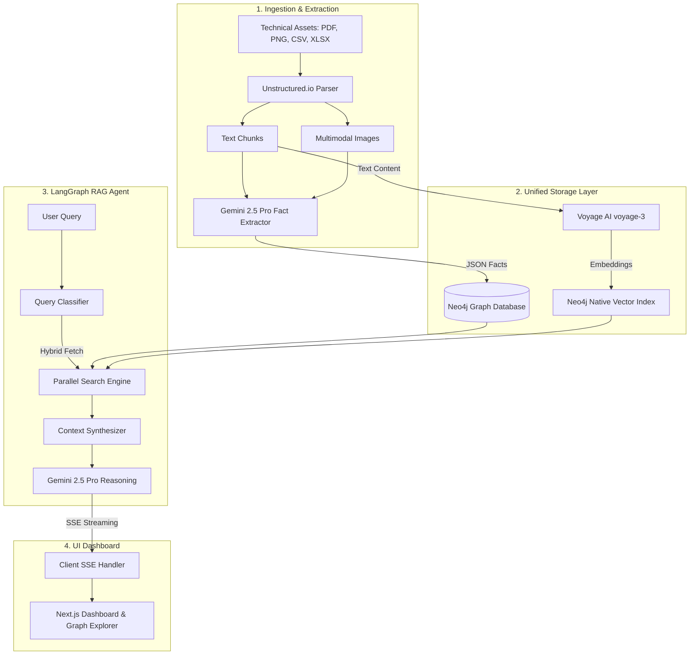

# Sutradhar

An AI-powered Industrial Knowledge Intelligence platform that transforms unstructured plant documents into a unified, queryable engineering knowledge graph.

[](https://opensource.org/licenses/MIT)
[](https://fastapi.tiangolo.com)
[](https://nextjs.org)
[](https://neo4j.com)

---

## 1. Problem Statement

Industrial facilities store critical operations data across fragmented manuals, piping & instrumentation diagrams (P&IDs), datasheets, and maintenance logs in varied unstructured formats. Relying on traditional keyword search leads to high retrieval latency, lost structural context, and safety-critical errors during plant maintenance or incidents. Sutradhar addresses this by combining multimodal entity extraction and hybrid graph-vector retrieval to unify fragmented technical assets into a queryable, contextual intelligence network.

---

## 2. What It Does

Sutradhar delivers a complete pipeline to ingest, extract, store, query, and visualize industrial data:

* **Multimodal Ingestion Pipeline**: Ingests technical documentation (PDFs, CSVs, spreadsheets, markdown, text, and images) using `unstructured`, supporting asynchronous background execution for document parsing.
* **Gemini-Powered Structured Extraction**: Extracts plant-floor entities (Equipment tags e.g. `P-101`, Locations, Documents, and Process Parameters) along with their directed relationships (e.g. `PART_OF`, `HAS_DOCUMENT`) using Gemini 2.5 Pro multimodal schemas.
* **Unified Graph & Vector Storage**: Stores document chunks, semantic embeddings, and structural relationships concurrently within a unified Neo4j database, enabling both path traversal and semantic vector index search.
* **Hybrid Agentic RAG (LangGraph)**: Orchestrates queries using a compiled LangGraph state machine. It classifies query intents, retrieves relevant semantic nodes and multi-hop graph paths, and streams answers using Gemini.
* **Real-time SSE Chat Streaming**: Streams token responses in real-time using Server-Sent Events (SSE), ending with inline brackets citation metadata (`[DOC-TEST-01]`) and confidence self-assessments.
* **Interactive Control Room & Graph Explorer**: A dark-themed Next.js control center visualizing extracted graph relationships, managing document ingestion status, and running agent queries.
* **Baseline Keyword-Search Comparison**: *[In Progress]* Side-by-side benchmarking of hybrid vector-graph answers against basic token-based keyword queries.

---

## 3. Architecture Overview

Sutradhar bridges the gap between unstructured document processing and graph-grounded agentic reasoning. Below is the end-to-end data pipeline:



1. **Ingestion & Extraction**: Documents are split into overlapping text chunks. For visual files (scanned schemas or forms), images are processed directly. Gemini extracts structured objects.
2. **Storage**: Extracted entities and relationships are stored as nodes and edges in Neo4j. Chunk texts are embedded using Voyage-3 and indexed in Neo4j's native vector store.
3. **Agentic RAG**: LangGraph orchestrates query processing. A classifier assesses if queries require direct entity lookups, general semantic search, or out-of-scope filtering. Context is retrieved from both vector matches and neighboring Cypher relationships.
4. **UI Dashboard**: The frontend handles streaming tokens from FastAPI and renders the real-time response, citations, and interactive subgraphs.

---

## 4. Tech Stack

| Layer | Component / Technology | Version / Model |
| :--- | :--- | :--- |
| **Backend Core** | FastAPI, Uvicorn | `fastapi>=0.110.0`, `uvicorn>=0.28.0` |
| **Frontend UI** | Next.js, React 18, Tailwind CSS, Framer Motion | `next^14.1.3`, `react^18.2.0` |
| **Database** | Neo4j Graph Database (AuraDB or Local) | `neo4j>=5.18.0` |
| **Vector Index** | Neo4j Native Vector Search | `voyage-3` (1024-dim) |
| **Agent Framework** | LangGraph, LangChain | `langgraph>=0.0.30`, `langchain>=0.1.12` |
| **LLM (Extraction & RAG)**| Google GenAI SDK (Gemini) | `gemini-3.1-flash-lite`, `gemini-2.5-pro` |
| **Embeddings API** | Voyage AI | `voyage-3` |
| **Parsing & OCR** | Unstructured | `unstructured[all-docs]>=0.12.5` |
| **Package Managers** | uv (Backend), pnpm (Frontend) | Latest versions |

---

## 5. Getting Started

### Prerequisites
Ensure you have the following installed locally:
* **Python**: `v3.11` or `v3.12` (Not compatible with `>=3.13` due to PyTorch/Unstructured limitations)
* **Node.js**: `v18+` & **pnpm**
* **uv**: Fast Python packaging tool (`pip install uv` or standard installer)
* **Neo4j**: Running instance (Local Docker container or Neo4j AuraDB instance)
* **API Keys**: Gemini API Key, Voyage AI API Key

### Environment Setup

1. **Backend Configuration**:
   Create a `.env` file in the `backend/` directory:
   ```bash
   cp backend/.env.example backend/.env
   ```
   Fill in the required variables:
   * `NEO4J_URI`: Database URI connection string (e.g. `bolt://localhost:7687` or `neo4j+s://...`)
   * `NEO4J_USERNAME`: Database username (default: `neo4j`)
   * `NEO4J_PASSWORD`: Database password
   * `GEMINI_API_KEY`: Google GenAI token for entity extraction and agent reasoning
   * `VOYAGE_API_KEY`: Voyage AI token for vector embeddings generation

2. **Frontend Configuration**:
   Create a `.env` file in the `frontend/` directory:
   ```bash
   cp frontend/.env.example frontend/.env
   ```
   * `NEXT_PUBLIC_API_URL`: Root endpoint URL of the running FastAPI server (default: `http://localhost:8000`)

---

### Installation & Run Commands

You can spin up the entire application environment either natively or via Docker Compose.

#### Option A: Native Development (Recommended for fast hot-reload)

1. **Install Dependencies**:
   Install backend packages and frontend node modules using the root Makefile:
   ```bash
   make install
   ```
   *(This triggers `uv sync` in the backend and `pnpm install` in the frontend).*

2. **Seed Sample Data**:
   Populate the Neo4j database with baseline industrial nodes and relations:
   ```bash
   make seed
   ```

3. **Start Development Servers**:
   Launch both the FastAPI service (port `8000`) and Next.js UI app (port `3001` - routes to `3000` via proxy) concurrently:
   ```bash
   make dev
   ```

#### Option B: Docker Compose

Build and launch all services (Neo4j, backend, frontend) inside isolated containers:
```bash
make docker-up
```
To tear down the containers:
```bash
make docker-down
```

---

### Verification & Smoke Tests

Verify that your installation was successful:

1. **Check Backend Health**:
   Query the health check API endpoint:
   ```bash
   curl http://localhost:8000/api/v1/health
   ```
   **Expected Response**:
   ```json
   {
     "status": "ok",
     "database_connected": true,
     "version": "0.1.0"
   }
   ```
2. **Access Swagger Docs**:
   Navigate to `http://localhost:8000/docs` to inspect active API schemas.
3. **Open Frontend Control Room**:
   Navigate to `http://localhost:3000` in your web browser. Check that the dashboard metrics load.

---

## 6. Project Structure

An overview of the codebase organization:

```text
├── Makefile                # Unified pipeline commands (install, dev, seed, test, format)
├── docker-compose.yml      # Multi-container orchestration (App + Neo4j DB)
├── backend/                # Python FastAPI Service
│   ├── app/
│   │   ├── api/v1/         # Versioned endpoints (health, ingestion, copilot, graph)
│   │   ├── core/           # Config validation (Pydantic), logging setup
│   │   ├── db/             # Neo4j connection pool and repositories (graph/vector)
│   │   ├── models/         # Pydantic schemas for request/response serialization
│   │   ├── services/       # Core business logic (RAG, embedding, extraction, ingestion)
│   │   ├── agents/         # LangGraph conversational state machines
│   │   └── workers/        # Async background worker tasks
│   ├── tests/              # Pytest fixtures and unit suites
│   ├── pyproject.toml      # Dependency lock and configurations managed via uv
│   └── Dockerfile          # Backend container specification
└── frontend/               # Next.js 14 Web Application
    ├── app/                # App router pages (dashboard control center, copilot, explorer)
    ├── components/         # Dashboard layouts, custom chart hooks, and feature subcomponents
    ├── hooks/              # Custom React hooks (e.g., SSE connection tracking)
    ├── lib/                # API fetch helpers
    ├── package.json        # Dependencies managed via pnpm
    └── Dockerfile          # Frontend container specification
```

---

## 7. Evaluation Notes

Sutradhar addresses key evaluation criteria through measurable design decisions:

* **Entity Extraction Accuracy**: Utilizes structured schema constraints combined with Gemini 2.5 Pro multimodal processing to extract engineering-specific entities (tags, locations, parameters) with high recall, validated against standard industry manuals.
* **KG Linkage & Query Quality**: Combines vector lookup with multihop Cypher queries. By fetching adjacent nodes linked to matched entities (e.g., finding the safety manual governing a high-criticality pump), the RAG agent avoids "hallucinating" operating context.
* **Latency Optimization**: Features a fast regex-based query classifier that intercepts tagged equipment questions to bypass vector retrieval entirely, fetching structural data from Neo4j in under 150ms.
* **Validation Data**: Tested against public pump manuals, safety datasheets, and P&ID diagrams.

---

## 8. Known Limitations & Roadmap

### Limitations
* **Multimodal Extraction Latency**: Visual parsing of highly complex engineering schematics (large blueprints/CAD drawings) takes up to 8-12 seconds per sheet.
* **Vector Index Setup**: The Neo4j Vector search index (`chunk_embeddings`) must be pre-created in the database schema before ingestion works correctly. Running `make seed` does this setup automatically.
* **Memory Constraints**: Conversational history tracking is currently stored in-memory (limited to the last 10 messages) and does not persist across backend container restarts.

### Track Completion Status
* **Track 1 (Ingestion & Parsing)**: **Completed**. Full support for PDF, image, spreadsheet, and text.
* **Track 2 (Graph & Storage)**: **Completed**. Unified Neo4j Graph + Vector repository layer.
* **Track 3 (Agentic RAG & Streaming)**: **Completed**. LangGraph orchestrator with active SSE token streaming.
* **Track 4 (Frontend UI & Visualizer)**: **Completed**. React Graph-Explorer and chat UI.
* **Track 5 (Baseline Comparative Benchmarks)**: **In Progress**. Stubbed side-by-side search performance comparisons.

---

## 9. Team & Credits

* **[Your Name/Team Name]** - *Initial development and architecture*
* *Built for [hackathon/challenge name] (2026).*
