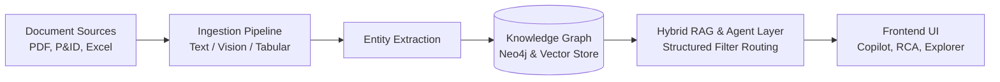
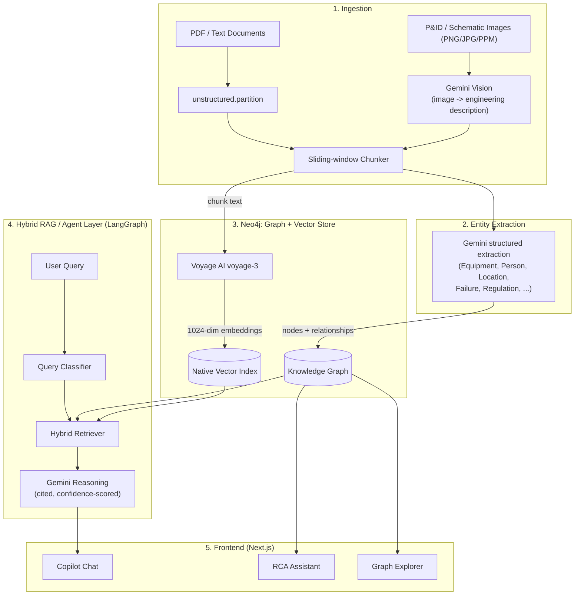

# Marg

An industrial knowledge terminal that transforms unstructured engineering documents into a navigable, queryable graph.

## Problem Statement

Industrial maintenance and operations teams struggle with fragmented documentation scattered across PDF manuals, tabular spreadsheets, and visual P&ID schematics. When critical failures occur, technicians waste hours cross-referencing these silos to diagnose root causes or locate affected equipment. Traditional keyword search engines fail because they cannot connect relationships across disparate document types or parse structured connections hidden in complex schematics and tables.

## What It Does

- **Document ingestion**: Supports PDFs, P&ID images (via vision models), and spreadsheets (.xlsx/.csv). Each pipeline performs structured entity extraction AND relationship linking (e.g., spreadsheet rows correctly link Equipment to Location, not just to the source document).
- **Knowledge graph with entity deduplication**: Normalizes entities (e.g., casing variants consolidate to a single canonical node) with readable `display_name`s, verified across all document types.
- **Hybrid RAG Copilot**: Combines vector similarity and graph traversal. Includes a dedicated structured-filter query path for exact-match questions (e.g., "list all equipment with High criticality") that routes directly to Cypher queries rather than relying on semantic similarity ranking.
- **Per-claim citations**: Each individual fact in a multi-item answer links to its own specific source chunk, eliminating broad, unhelpful document-level references.
- **Streaming responses & confidence scoring**: Real-time generation with honest "I don't know" behavior on out-of-scope queries.
- **Keyword search with side-by-side benchmarking**: Directly compare the Copilot's output against a traditional keyword search with real latency numbers and search comparisons.
- **RCA Assistant**: Generates a structured 5-section root cause analysis from Failure nodes (Root Cause / Contributing Factors / Affected Equipment / Related Regulations / Recommended Action), fully cited.
- **Equipment identification via photo**: Visual search reads visible equipment tags from uploaded photos or camera capture, looking up the matching graph entity automatically.
- **Voice input**: Record queries via microphone and have them automatically transcribed into the input field.
- **Query history**: Persistent global log of past queries, answers, and citations for audit traceability (global by design as there is no user authentication).
- **Interactive P&ID Graph Explorer**: 2D force-directed canvas with dynamic overlap prevention, chunk/isolated-node visibility toggles, and fuzzy search.
- **Mobile-responsive UI**: Tested on real mobile devices (375px/768px breakpoints) with tailored touch-friendly navigation, bottom sheets, and responsive side-by-side toggles.

## Architecture

### High-Level Data Flow



### Detailed Component Architecture



## Tech Stack

| Component             | Technology                                   |
| :-------------------- | :------------------------------------------- |
| **Backend Framework** | FastAPI, LangGraph                           |
| **Database**          | Neo4j AuraDB (Unified Graph & Vector Store)  |
| **Embeddings Model**  | Voyage AI (`voyage-4`)                       |
| **LLM Engine**        | Gemini (`gemini-3.1-flash-lite`)             |
| **Frontend**          | Next.js, TypeScript, Tailwind CSS, shadcn/ui |

## Getting Started

### Prerequisites

- Node.js (v20+)
- Python 3.11+ with `uv` installed
- Docker (for local Neo4j instance)

### 1. Environment Setup

Create a `.env` file in the `backend/` directory:

```bash
cp backend/.env.example backend/.env
```

Ensure the following keys are populated in `backend/.env`:

```env
NEO4J_URI="bolt://localhost:7687"
NEO4J_USERNAME="neo4j"
NEO4J_PASSWORD="password123"
GEMINI_API_KEY="your-gemini-api-key-here"
VOYAGE_API_KEY="your-voyage-api-key-here"
```

### 2. Installation

Install dependencies for both frontend and backend from the root directory:

```bash
make install
```

### 3. Start Database

Spin up the local Neo4j Docker container:

```bash
make docker-up
```

### 4. Run Development Servers

Start both the FastAPI backend and Next.js frontend concurrently:

```bash
make dev
```

- **Frontend**: http://localhost:3001
- **Backend API**: http://localhost:8000

### 5. Smoke Test

Once running, verify the backend by hitting the health check endpoint:

```bash
curl http://localhost:8000/health
```

## Project Structure

```text
.
├── backend/                  # FastAPI Python backend
│   ├── app/                  # Application code (API routers, agents, services)
│   ├── sample-data/          # Test PDFs, schematics, and tabular data
│   ├── pyproject.toml        # Backend dependencies
│   └── .env                  # Backend configuration (keys & models)
├── frontend/                 # Next.js React frontend
│   ├── app/                  # App router pages (Copilot, Graph Explorer, RCA)
│   ├── components/           # UI components (shadcn & custom)
│   ├── hooks/                # React hooks (e.g., streaming chat, voice)
│   └── package.json          # Frontend dependencies
├── docker-compose.yml        # Local Neo4j database setup
├── Makefile                  # Helper commands for local dev (install, dev, test)
└── PROJECT_STATUS.md         # Detailed verification and testing report
```

## Real Data Used

The system has been built and tested on real-world industrial data:

1. **Dow Chemical LaPorte Incident Report** (Real U.S. Chemical Safety Board investigation)
2. **Chevron Richmond Refinery Incident Report** (Real U.S. Chemical Safety Board investigation)
3. Synthetic SOP (Standard Operating Procedure) documents.
4. Equipment inventory spreadsheet test data.

## Evaluation Criteria Mapping

- **Entity Extraction Accuracy**: Verified 199 total nodes dynamically extracted, with structured properties (e.g., criticality) reliably populated, resolving null-value issues.
- **Query Answer Quality**: RCA Assistant generates high-quality, fully cited outputs. The Copilot exhibits honest low-confidence/refusal behavior on out-of-scope queries and correctly handles conflicting source data (e.g., surfacing conflicts when an equipment is classified differently across two documents rather than silently picking one).
- **Knowledge Graph Linkage Completeness**: Successfully writes complex relationships (`RELATES_TO`, `PART_OF`, `APPLIES_TO`). Isolated nodes were significantly reduced after applying relationship-writing fixes to the spreadsheet ingestion pipeline.
- **Time-to-Answer vs Traditional Search**: Real benchmarked numbers surface in the side-by-side keyword search comparison tool, providing exact latency and relevancy differences.
- **Real Document Validation**: Successfully processed complex, multi-page CSB reports and visual P&ID schematics.

## Track Completion Status

- **Track 1 (Ingestion & KG Agent)**: **Working**. PDF, P&ID, and spreadsheet support verified. Scanned forms and email archives are not implemented (deliberate scope decision).
- **Track 2 (Expert Knowledge Copilot)**: **Working**.
- **Track 3 (Maintenance Intelligence & RCA Agent)**: **Working**.
- **Track 4 (Quality & Regulatory Compliance)**: Not implemented.
- **Track 5 (Lessons Learned & Failure Intelligence)**: Not implemented.

## Known Limitations

- **Isolated Nodes**: A small percentage of isolated nodes still occasionally appear during unstructured text parsing due to ambiguous coreference resolution.
- **Voyage AI Rate Limits**: The current free-tier key operates under a strict 3 RPM / 10K TPM limit. The system uses progressive backoffs during ingestion, but rapid batch uploads may encounter `HTTP 429` errors.
- **No Authentication**: The platform lacks multi-user authentication. Query history is global by design.

## Team / Credits

- Hakuna Matat
