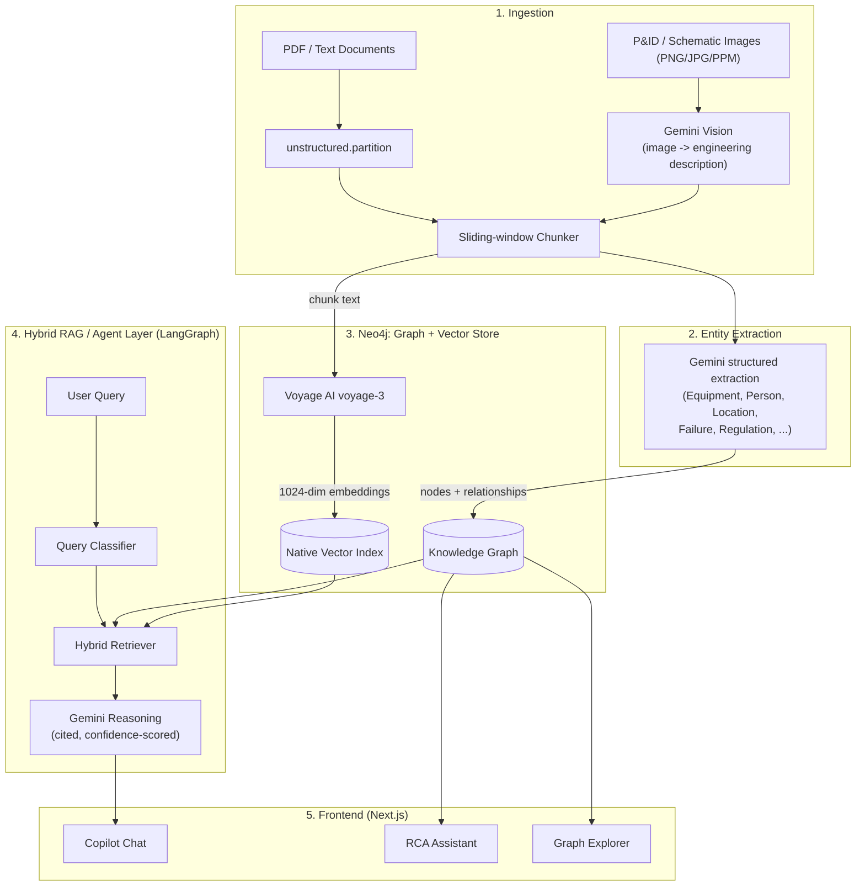

# Marg

A knowledge graph and RAG platform that turns scattered industrial PDFs, P&ID images, and safety reports into a queryable engineering knowledge base — with a chat copilot, a root-cause-analysis assistant, and a graph explorer on top.

---

## 1. Problem Statement

Industrial plants generate their most safety-critical knowledge — operating manuals, P&IDs, incident investigations, regulatory references — as disconnected PDFs and scanned drawings sitting in separate systems. An engineer trying to answer "why did this pump fail, and what governs how we fix it" has to manually cross-reference a maintenance log, a P&ID, and a regulation, because nothing links them. Keyword search over these documents returns pages to read, not answers, and it has no notion of the structural relationships (which equipment belongs to which unit, which regulation governs which failure) that the question actually depends on. Marg addresses this by extracting entities and relationships from these documents into a knowledge graph, and answering questions by combining vector search over the text with graph traversal over the structure.

---

## 2. What It Does

- **Document ingestion** — PDF/text documents are parsed and chunked; P&ID and schematic images (PNG/JPG/PPM) are sent directly to Gemini vision, which produces a detailed engineering transcription that is then chunked and embedded like any other text.
- **Knowledge graph construction with entity deduplication** — Gemini extracts Equipment, Document, Person, Location, ProcessParameter, Failure, WorkOrder, Regulation, InspectionFinding, Procedure, and NonConformance entities plus directed relationships between them. Entity keys are normalized (lowercased, whitespace/hyphens stripped) before being merged into Neo4j, so `"4-Sidecut Line"`, `"4-sidecut-line"`, and `"4-sidecut line"` all collapse into one canonical node.
- **Hybrid RAG Copilot** — a LangGraph pipeline classifies the query, retrieves both vector-similar chunks and graph-connected facts, and streams the answer token-by-token over SSE with inline citations (`[DOC-xxx]`) and a self-reported confidence level (high/medium/low). It explicitly says so and cites nothing when a question is out of scope, rather than guessing.
- **Keyword search with side-by-side Copilot benchmarking** — a real Lucene full-text search (not a mock) runs against the same graph, and the Copilot UI has a "Compare" mode that runs both methods on the same query and reports raw result count + latency for keyword search against the Copilot's synthesized, cited answer + latency — a direct, visible demonstration of time-to-answer versus traditional search.
- **RCA Assistant** — given a `Failure` node, a LangGraph agent pulls its connected equipment, work orders/inspection findings, and regulations (1–2 hop graph traversal) plus the source document chunks, and generates a structured report with five fixed, cited sections: Root Cause, Contributing Factors, Affected Equipment, Related Regulations, Recommended Action.
- **Interactive P&ID Graph Explorer** — a force-directed 2D graph of the knowledge graph with independent toggles to show/hide raw text `Chunk` nodes and to show/hide isolated (unconnected) nodes.
- **Mobile-responsive UI** — sidebars collapse to bottom navigation, detail panels become slide-up bottom sheets with safe-area insets and 44px tap targets, and the graph explorer re-centers on viewport resize.

---

## 3. Architecture Overview

Documents (real PDFs and P&ID images) go through OCR/vision extraction into text, get chunked and embedded, and get run through structured entity extraction. Everything lands in Neo4j, which serves as both the graph store and the vector index. A LangGraph agent layer sits on top and answers queries by combining graph traversal with vector search, and three frontend surfaces (Copilot, RCA Assistant, Graph Explorer) consume that agent layer.



---

## 4. Tech Stack

| Layer | Component | Version (resolved) |
| :--- | :--- | :--- |
| Backend | FastAPI, Uvicorn | `fastapi 0.139.0`, `uvicorn>=0.28.0` |
| Agent framework | LangGraph, LangChain | `langgraph 1.2.9`, `langchain 1.3.13` |
| Database | Neo4j (server) | `5.18.0-community` (Docker), driver `6.2.0` |
| Vector store | Neo4j native vector index | 1024-dim, cosine similarity |
| Embeddings | Voyage AI | `voyage-3`, `voyageai` SDK `0.5.0` — **real API key active**, not mock |
| LLM (extraction, RAG, RCA) | Google GenAI SDK | `google-genai 2.11.0`, model **`gemini-3.1-flash-lite`** |
| Parsing/OCR | Unstructured | `unstructured 0.24.1` (text); Gemini vision (images) |
| Frontend | Next.js, React, Tailwind, Framer Motion | `next 14.1.3`, `react 18.2.0`, `tailwindcss 3.4.1`, `framer-motion 11.0.8` |
| Graph rendering | react-force-graph-2d/3d, d3-force, three.js | `react-force-graph 1.29.1` |
| Package managers | uv (backend), pnpm (frontend) | — |

> **Note on the LLM:** the codebase is configured for and actually runs `gemini-3.1-flash-lite` (set via `GEMINI_REASONING_MODEL` in `.env`) — not Gemini 2.5 Pro. One stale inline comment in `copilot_agent.py` still says `# gemini-2.5-pro`; the setting it annotates is what actually executes, and it resolves to `gemini-3.1-flash-lite`. Swapping models is a one-line `.env` change if 2.5 Pro is wanted for quality reasons.

---

## 5. Getting Started

### Prerequisites
- Python 3.11 or 3.12 (not 3.13+, per `unstructured`/PyTorch constraints)
- Node.js 18+ and pnpm
- `uv` (Python package manager)
- Docker (for Neo4j), or a Neo4j 5.18+ instance / AuraDB
- API keys: **Gemini** and **Voyage AI**

### Environment Setup

```bash
cp backend/.env.example backend/.env
cp frontend/.env.example frontend/.env
```

Fill in `backend/.env`:

| Variable | Purpose |
| :--- | :--- |
| `NEO4J_URI`, `NEO4J_USERNAME`, `NEO4J_PASSWORD` | Database connection |
| `GEMINI_API_KEY` | Entity extraction, RAG/RCA reasoning, vision |
| `VOYAGE_API_KEY` | Chunk embeddings (voyage-3) |
| `GEMINI_REASONING_MODEL` | Defaults to `gemini-3.1-flash-lite`; override to try other models |
| `UPLOAD_DIR`, `INGESTION_CONCURRENCY`, `MAX_DOCUMENT_SIZE_MB` | Ingestion worker tuning |

Without real `GEMINI_API_KEY`/`VOYAGE_API_KEY` values, both services silently fall back to mock mode (fixed dummy embeddings/extractions) — fine for offline unit tests, not for real ingestion or Copilot answers.

`frontend/.env` just needs `NEXT_PUBLIC_API_URL` (default `http://localhost:8000`).

### Run It

```bash
make install   # uv sync (backend) + pnpm install (frontend)
make dev       # runs backend on :8000 and frontend on :3001 concurrently
```

The backend also needs the Neo4j schema (constraints, vector index, full-text indexes) applied once — run the statements in `backend/app/db/schema/init_schema.cypher` against your database (via `cypher-shell`, Neo4j Browser, or AuraDB console).

Docker Compose alternative: `make docker-up` / `make docker-down` (brings up Neo4j + backend + frontend containers). Note: the frontend container's `docker-compose.yml` command runs the `pnpm dev` dev server (which listens on port 3001 per `package.json`), while only port 3000 is published — for Docker use, prefer building the image as-is (`Dockerfile`'s standalone production server correctly binds `PORT=3000`) rather than the Compose override.

### Smoke Test

```bash
curl http://localhost:8000/api/v1/health
# {"status":"ok","database_connected":true,"version":"0.1.0"}
```

Then open `http://localhost:3001` (native dev) and either upload a document via Ingestion, or query the Copilot directly:

```bash
curl -N -X POST http://localhost:8000/api/v1/copilot/query \
  -H "Content-Type: application/json" \
  -d '{"query":"What caused the Chevron Richmond pipe rupture?","conversation_id":"smoke-test"}'
```

This streams SSE `token` events followed by a `done` event containing the answer, citations, and confidence.

---

## 6. Project Structure

```text
backend/app/
├── api/v1/endpoints/   # health, ingestion, copilot, rca, search, graph, stats
├── agents/             # LangGraph state machines: rag_agent, copilot_agent, rca_agent
├── services/           # extraction_service (Gemini), embedding_service (Voyage),
│                       #   rag_service, rca_service, ingestion_service
├── workers/            # ingestion_worker — the actual parse -> extract -> embed -> write pipeline
├── db/                 # neo4j_connection, repositories (graph_repository, vector_repository)
│   └── schema/         # init_schema.cypher — constraints + vector + full-text indexes
├── models/             # extraction.py (entity schemas), schemas.py (API contracts)
└── tests/              # 10 tests: mocked unit tests + live integration tests against
                        #   the real Neo4j instance and real CSB documents

frontend/
├── app/(dashboard)/    # copilot, rca, graph-explorer, ingestion pages
├── components/features/graph-explorer/  # InteractiveGraph.tsx (force-directed canvas)
└── components/ui/      # bottom-sheet.tsx and other shared UI primitives
```

---

## 7. Real Data Used

This wasn't tested only against synthetic data. Two public **U.S. Chemical Safety and Hazard Investigation Board (CSB)** final investigation reports are ingested end-to-end in `backend/sample-data/`:

- **Chevron Richmond Refinery Pipe Rupture and Fire** — CSB Report No. 2012-03-I-CA (January 2015), incident of August 6, 2012 (sulfidation corrosion failure of the #4 Crude Unit's 4-sidecut piping).
- **Dow Louisiana Operations (Plaquemine, LA) — Explosions, Fires, and Toxic Ethylene Oxide Release** — CSB Report No. 2023-03-I-LA, incident of July 14, 2023.

Both are searchable at [csb.gov](https://www.csb.gov) under their report numbers. Alongside these, the graph also contains synthetic SOP documents and P&ID schematic images (as PPM/image files run through the Gemini vision path) used to exercise the Equipment/ProcessParameter extraction and P&ID ingestion paths.

Of the 57 `Document`-labeled nodes currently in the graph, only 6 are actual ingested source files (the two CSB PDFs, two P&ID images, and two text/SOP documents); the remaining ~51 are `Document` *entities* that Gemini extracted because they were referenced or cited inside that source text (e.g. a regulation or a prior report mentioned in a paragraph), not files that went through the pipeline themselves.

---

## 8. Evaluation Criteria Mapping

**Entity extraction accuracy** — live counts from the running Neo4j instance:

| Label | Count |
| :--- | ---: |
| Document | 57 (6 ingested source files + 51 referenced-document entities) |
| Equipment | 44 |
| Chunk | 28 |
| ProcessParameter | 23 |
| Regulation | 16 |
| Person | 14 |
| Failure | 9 |
| Location | 7 |
| WorkOrder | 1 |

Total: 199 nodes, 269 relationships. A Cypher aggregation on the dedup keys (`tag`/`name`/`code`) shows no duplicate normalized entities.

**Query answer quality** — the RCA Assistant reliably produces all five required sections (verified live against the Chevron sulfidation failure node, with citations back to `chevron_final_investigation_report.pdf`). The Copilot's confidence/refusal behavior was verified directly: asked *"What is the maintenance schedule for a nuclear reactor?"* (out of scope), it responded with **no citations, `confidence: "high"`**, and an explicit statement that the ingested documents don't cover that topic, rather than fabricating an answer.

**Knowledge graph linkage completeness** — of the 114 non-Chunk, non-Document entity nodes, **16 (14.0%) are fully isolated** (no relationships): 10 Equipment, 4 ProcessParameter, 2 Person. Inspecting them shows they're instrument/control-loop tags and parameter names (e.g. `FV-101`, `LT-102`, `Reflux Flow`) that Gemini extracted as entities from a chunk's text but for which it didn't also emit an explicit relationship in that same extraction call — an expected consequence of chunk-by-chunk extraction rather than a data-quality bug. The remainder of the gap is a known topology-extraction limitation: relationships are only as complete as what Gemini identifies per chunk, so entities mentioned in passing (rather than in a structurally explicit sentence) are more likely to end up unlinked.

**Time-to-answer vs. traditional search** — measured live on the query *"sulfidation corrosion"*: keyword search returned 15 ranked chunk matches (~40,800 words of raw text to read) in **0.07s**; the Copilot returned a single synthesized, cited answer in **~5.3s**. The UI's own "Benchmarking Delta Analysis" banner reports exactly this trade-off (raw record count + latency vs. synthesized answer + latency, plus an estimated word count saved) on every comparison run.

**Real document validation** — both CSB reports ingest, chunk, embed, and extract successfully; the RCA and Copilot integration tests assert (and pass) that answers about the Chevron incident cite the actual `chevron_final_investigation_report.pdf`.

---

## 9. Track Completion Status

| Track | Status | Notes |
| :--- | :--- | :--- |
| **1 — Ingestion & KG Agent** | **Working** | PDF/text parsing and P&ID image vision extraction are both implemented and verified end-to-end. Spreadsheets, email archives, and scanned forms are not implemented — `unstructured`'s generic partitioner could technically attempt other formats, but only PDF/text and image inputs have been tested against real documents. |
| **2 — Expert Knowledge Copilot** | **Working** | Hybrid vector+graph retrieval, SSE token streaming, inline citations, and confidence scoring are all live and verified against real ingested documents. |
| **3 — Maintenance Intelligence & RCA Agent** | **Working** | The RCA Assistant generates the required five-section structured report from `Failure` nodes, grounded in graph-linked equipment/work orders/regulations and cited source chunks. |
| **4 — Quality & Regulatory Compliance** | **Not implemented** | No dedicated compliance-checking logic exists (no NCR-workflow or automated regulation-conformance endpoints). Descoped deliberately to go deep on ingestion, RAG, and RCA rather than spread thin across five tracks in the available time. |
| **5 — Lessons Learned & Failure Intelligence** | **Not implemented** | No cross-incident trend/lessons-learned aggregation feature exists beyond the per-failure RCA report. Same scoping call as Track 4. |

Three of five tracks are built deep and verified against real safety-critical documents, not stubbed.

---

## 10. Known Limitations

- **Isolated nodes**: ~14% of entity nodes (16/114) have no graph relationships — see §8 for why.
- **Voyage AI free-tier rate limits**: 3 requests/minute, 10K tokens/minute. `embedding_service.py` batches at `batch_size=1` and sleeps 22s between batches to stay under this — ingesting a document with many chunks can take several minutes. Gemini calls also back off on 429/quota errors (up to 6 retries).
- **No frontend automated tests**: `pnpm test` is a placeholder (`"echo \"No tests specified yet\""`); the backend has 10 passing pytest tests (mocked unit tests + live integration tests), but frontend correctness relies on manual verification.
- **In-memory ingestion job cache**: job status has a DB-persisted fallback, but the primary path is an in-process dict, so status can be lost across backend restarts if the DB write also fails.
- **`make seed`** (`app/scripts/seed_data.py`) reads from a hardcoded external path (`Project_E_T/data-gen/output`) that doesn't exist in this environment — it is not currently a working way to reproduce the seeded dataset; the documents that are in the graph today were ingested via the API directly.
- **Docker Compose port mismatch**: the frontend's Compose service command (`pnpm dev`, port 3001) doesn't match its published port (3000) or the Dockerfile's standalone production server (port 3000) — see §5.
- **No LICENSE file** in the repo — the previous README's MIT badge did not correspond to an actual license file and has been dropped rather than carried forward unverified.

---

## 11. Team & Credits

*[Add names/roles here.]*
